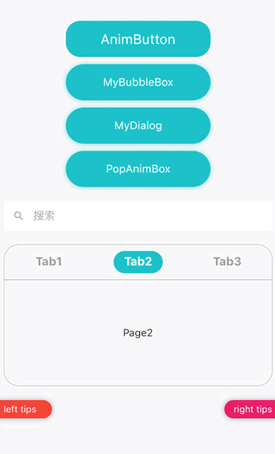

## 全局通用组件



### anim_button
让被包装的物体带点击事件，被点击的时候播放动画。
在需要该特性的位置直接替换 `GestureDetector` 使用就可以了。
- tapTime 按钮触发时机
  - BeforeAnim 动画播放前
  - AfterAnim 动画播放完
  - WhenTap 是要 onTap 就触发
- group 分组，同组不能同时触发点击事件
- animController 外部传入可以控制按钮动画
- endScale 播放完成的大小，< 1 播放缩小动画 >1 播放放大动画

```dart
 AnimButton(
  onTap: () {},
  child: Container(
    alignment: Alignment.center,
    decoration: BoxDecoration(
        color: Theme.of(context).primaryColor,
        borderRadius: BorderRadius.circular(20)),
    width: 200,
    height: 50,
    child: Text(
      'AnimButton',
      style: TextStyle(
        fontSize: 20,
        color: Colors.white,
      ),
    ),
  ),
)
```

### keep_alive_wrapper

KeepAlive 包装

```dart
PageView(
  controller: controller.pageController,
  physics: NeverScrollableScrollPhysics(),
  children: [
    KeepAliveWrapper(child: GameHallView()),
    KeepAliveWrapper(child: BattleHallView()),
    KeepAliveWrapper(child: DailyChallengeRankView()),
    KeepAliveWrapper(child: MeView()),
  ],
)
```
 
### my_bubble_box

通常和 Toast.showAttachedWidget 配合，显示有箭头的容器，箭头指向 [targetCenterOffset] 位置。根据 [child] 布局自动撑开容器

```dart
// view.dart

MyButton(
  key: controller.bubbleBoxBtnKey,
  onTap: () {
    controller.showBubbleBox();
  },
  width: 200,
  height: 50,
  radius: 30,
  backgroundColor: Theme.of(context).primaryColor,
  text: 'MyBubbleBox',
  fontColor: Colors.white,
),

... 


// controller.dart

void showBubbleBox() {
  final context = bubbleBoxBtnKey.currentContext!;
  final box = context.findRenderObject() as RenderBox;
  final targetCenter = box.localToGlobal(Offset.zero) +
      Offset(box.paintBounds.width / 2, box.paintBounds.height / 2);
  BotToast.showAttachedWidget(
    attachedBuilder: (closeBubble) => MyBubbleBox(
      targetCenterOffset: targetCenter,
      backgroundColor: Colors.black38,
      child: Text(
        'BubbleBox',
        style: TextStyle(fontSize: 12, color: Colors.white),
      ),
    ),
    targetContext: context,
  );
}

```

### my_button.dart

通用按钮，支持文字，圆角，背景色配置，使用 `AnimButton` 实现按钮点击动画。

### my_dialog

通用 `Dialog` 包装，支持背景，标题，内容，按钮文字配置。
对于需要异步请求数据完成才决定是否关闭 `Dialog` 的情况可以传入 `onConfirm` 方法 

```dart
Get.dialog(MyDialog(
  backgroundColor: Get.theme.canvasColor,
  titleText: 'MyDialog',
  bodyText: 'Dialog info.',
  confirmText: 'OK',
  cancelText: 'Cancel',
  onConfirm: () async {
    if (MyTools.rand(2) == 0) {
      Toast.i('提交失败', '');
      return false;
    } else {
      return true;
    }
  },
));
```

### my_page_view 和 my_tab_bar

配合使用，可以实现 PageView 和 TabBar 的双向绑定

```dart

Column(
  children: [
    MyTabBar(
      tabs: ['Tab1', 'Tab2', 'Tab3'],
      tag: 'tabbar_tag',
      pageViewTag: 'pageview_tag',
    ),
    Divider(
      color: Theme.of(context).disabledColor,
    ),
    Expanded(
      child: MyPageView(
        tag: 'pageview_tag',
        tabBarTag: 'tabbar_tag',
        pages: [
          KeepAliveWrapper(
              child: Center(
            child: Text('Page1'),
          )),
          KeepAliveWrapper(
              child: Center(
            child: Text('Page2'),
          )),
          KeepAliveWrapper(
              child: Center(
            child: Text('Page3'),
          )),
        ],
      ),
    ),
  ],
)

```

### my_search_bar

标准化的 SearchBar，大部分样式不支持定制

```dart
MySearchBar(
  width: ScreenUtil.screenWidth - 20,
  height: 40,
  fontSize: 16,
),
```

### pop_anim_box

一般是用来包装 `Dialog` 使 `Dialog` 有弹出效果 

```dart
 Get.dialog(
      PopAnimBox(
        child: Dialog(
            child: Container(
          color: Colors.green,
          width: 200,
          height: 100,
        )),
      ),
    );
```

### tips_button

Tips 按钮，效果可以看顶部的效果图

```dart
Row(
  children: [
    TipsButton(
      onTap: () {},
      isLeft: true,
      title: 'left tips',
      backgroundColor: Colors.primaries[0],
      animateIn: true,
    ),
    Spacer(),
    TipsButton(
      onTap: () {},
      isLeft: false,
      title: 'right tips',
      backgroundColor: Colors.primaries[1],
    )
  ],
),
```